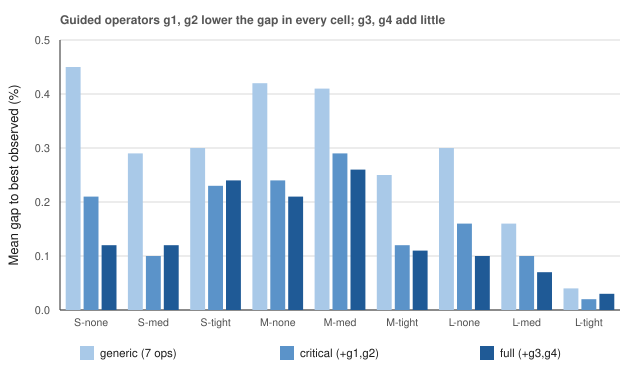
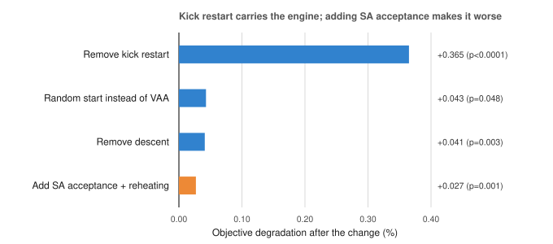
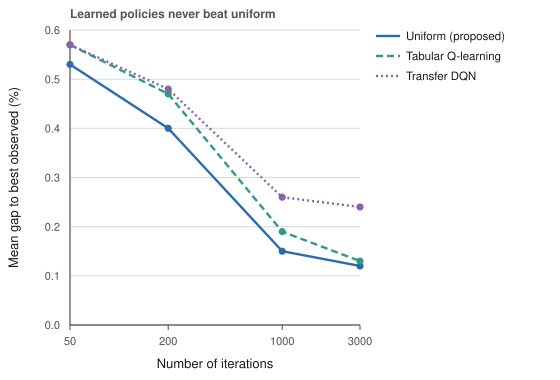
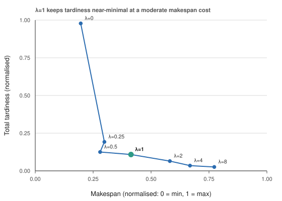

# 도착 시간창이 있는 입출고 병행 트럭 크로스도킹 스케줄링 — 병목 유도 반복 지역탐색과 정확해 기반 검증 —

**석사학위논문 초안 (2026-07-30)**

김영수 · 연세대학교 대학원 인공지능학과
지도교수: 권상진

> 편집 노트(제출 전 삭제): 본 파일은 4단 스토리(문제 확장 → 병목 유도
> GILS → CP-SAT 정확해 검증 → 학습 요소 ablation)에 맞춰 학위논문 체제로
> 확장한 국문 원고 초안이다. 수치·표는 동결된 test-pool 결과이며 영문
> 컨퍼런스 원고(`apiems2026_draft.md`) 및 `docs/b1_results.md`,
> `docs/b2_results.md`, `outputs/k1_stats.txt`와 일치한다. 용어 규율:
> `최적(optimal)`은 CP-SAT로 최적성이 *증명된* 셀(S-none 및 M-none 일부)에만
> 사용하고, 그 외에는 `근최적`/`고품질`/`알려진 최선해(best-known)`로 표기한다.

---

## 국문 초록

입고와 출고를 병행하는 트럭(compound truck, 이하 병행 트럭)이 부분하역 후 아웃바운드 트럭으로 재사용되는 다중 도어
크로스도킹 센터의 트럭 스케줄링 문제를 다룬다. 이 문제에 대한 기존 연구는
모든 트럭이 계획 시점(시각 0)에 가용하다고 가정하고 전체 완료시간(makespan)
만을 최소화하였다. 그러나 실제 물류 거점은 시차를 둔 예약 도착을 마주하며,
아웃바운드 출발은 위반 시 비용이 발생하는 마감 시각에 묶여 있다. 본 논문은
트럭별 도착(release) 시각과 소프트 출발 마감(due date)을 도입하여 이 문제를
현실적 운영 조건으로 확장하고, makespan과 가중 총지연의 합을 최소화한다.

방법론적 기여로, Vogel 근사 구성, 최선개선 지역탐색, 현재 병목(임계 트럭·
최대 지연 트럭)을 겨냥하는 유도(guided) 연산자, 시뮬레이티드 어닐링 수락,
킥 재시작을 결합한 결정론적 유도 반복 지역탐색 **VAA-GILS**를 제안한다.
정확해 기준이 존재하는 모든 테스트 셀에서 VAA-GILS는 CP-SAT 인컴번트 대비
0.1~0.6% 이내의 목적값에 1초 미만으로 도달하였고(CP-SAT는 76~376초), 소형
무시간창 인스턴스에서는 증명된 최적해와 일치하였다. CP-SAT가 600초 내에
가능해를 내지 못하는 대형 시간창 셀에서는 알려진 최선해 전부를 제공하였으며,
원 모델의 강화학습 기반 시뮬레이티드 어닐링을 통계적으로 유의하게 능가하였다
(p < 0.0001).

마지막으로, 엔진을 통제된 실험 장치로 사용하여 품질의 출처를 분해한다.
연산자 풀 ablation은 병목 유도 연산자가 9개 셀 전부에서 목적함수를 단조·
유의하게 낮춤을 보이고(p < 0.002), 컴포넌트 leave-one-out ablation은
최선개선 지역탐색이 최대 기여(제거 시 +0.156%), 킥 재시작이 그다음(+0.069%)
임을 보인다. 반면 세 가지 적응형 요소 — 학습 기반 연산자 선택(타뷸러
Q-learning 및 전이 학습 심층 Q-네트워크), 학습·개선된 초기해, 확률적 수락 —
은 어떤 반복 횟수에서도 실용적 이득을 주지 못하였다. 이로써 성능이
"학습된 선택"이 아니라 "문제 구조를 이용한 결정론적 지역탐색"에서 나옴을
정량적으로 규명하고, 적응형 요소가 효과를 낼 수 있는 조건과 없는 조건을
도출한다.

**주제어:** 크로스도킹; 트럭 스케줄링; 도착 시간창; 반복 지역탐색;
제약 프로그래밍; 유도 지역탐색; 강화학습 ablation

---

## 목차 (자동 생성 예정)

제1장 서론 · 제2장 관련 연구 · 제3장 문제 정의 및 수리모형 ·
제4장 VAA-GILS · 제5장 실험 설계 · 제6장 실험 결과 ·
제7장 논의 · 제8장 결론 및 향후 연구 · 참고문헌

---

## 제1장 서론

### 1.1 연구 배경

크로스도킹(cross-docking)은 입고된 제품을 창고에 보관하지 않고 곧바로 출고
트럭으로 환적하여 재고 보유와 리드타임을 줄이는 물류 운영 방식이다 [2].
저장 단계를 사실상 생략하기 때문에 도크에서의 트럭 배정·순서 결정, 즉 트럭
스케줄링의 품질이 거점 전체의 처리 시간을 좌우한다 [1, 3].

Joo와 Kim [4]이 도입하고 Shahmardan과 Sajadieh [5]가 발전시킨 **병행 트럭(compound truck)** 변형에서는 하나의 트럭이 입고·출고 두 역할을 겸한다.
병행 트럭은 여러 목적지행 제품을 싣고 도착하여 *부분적으로* 하역되며 —
한 목적지의 수요는 실은 채 유지 — 이후 그 목적지의 나머지 수요를 적재한 뒤
아웃바운드 트럭으로 출발한다. 부분하역은 전량 하역 대비 makespan을 최대
56%까지 줄이는 것으로 보고되어 [5], LTL(less-than-truckload) 통합
네트워크에서 실용적 매력이 크다.

### 1.2 문제 의식과 연구 목표

기존 병행 트럭 모델의 두 가정이 현실성을 제약한다.

- **모든 트럭이 시각 0에 가용.** 실제 도크는 운송사·노선별로 시차를 둔
  예약 도착을 마주한다. 이른 시각에 계획하더라도 트럭이 도착하기 전에는
  어떤 하역·이송·적재도 시작할 수 없다.
- **순수 makespan 목적.** 아웃바운드 출발은 보통 하류 배송 약속(마감)에
  묶여 있으며, 마감 위반은 지연 비용으로 이어진다. makespan만 최소화하면
  이러한 납기 압박이 목적함수에 반영되지 않는다.

본 논문은 이 두 가정을 제거하여 문제를 **도착 시간창(release time) + 소프트
마감(soft due date)** 이 있는 형태로 확장하고, makespan과 가중 총지연의 합을
동시에 최소화한다. 연구 목표는 (1) 확장된 문제의 정확한 수리적 정식화와
검증 가능한 벤치마크를 확립하고, (2) 정확해에 필적하면서 수 초 내에 동작하는
고속 근최적 휴리스틱을 설계하며, (3) 그 성능이 어디에서 오는지를 통제된
ablation으로 규명하는 것이다.

### 1.3 기여

본 논문의 기여는 지도교수 피드백에 따라 다음 네 단계 이야기로 구성된다.

1. **문제 확장.** 트럭별 도착 시각과 소프트 마감이 있는 입출고 병행 트럭 크로스도킹 스케줄링 문제를 — 저자가 아는 한 최초로 — 정식화한다. big-M
   혼합정수계획(MILP), reified CP-SAT 모형, 목적함수에 대한 유효 조합 하한,
   그리고 train/tuning/test 시드가 엄격히 분리된 매개변수화 인스턴스
   생성기를 제공한다.

2. **탐색 방법.** 결정론적 유도 반복 지역탐색 **VAA-GILS**를 제안한다. 학습
   요소가 전혀 없음에도, 정확해 기준이 존재하는 모든 곳에서 최신 정확해
   솔버(CP-SAT)의 인컴번트와 대등하며(0.1~0.6% 이내, 계산 시간 70~700분의
   1), 정확해 솔버가 해를 내지 못하는 곳에서는 알려진 최선해를 제공한다.

3. **정확해 기반 검증.** CP-SAT를 통해 소형 셀에서 최적성을 증명하고 중형
   셀에서 근최적 기준을 확보함으로써, 휴리스틱의 품질을 "그럴듯함"이 아니라
   증명·인컴번트 대비 갭으로 정량 검증한다.

4. **학습 요소 분석(ablation).** 엔진을 통제된 장치로 사용하여 품질의
   출처를 분해한다. 연산자 풀 ablation과 컴포넌트 leave-one-out ablation은
   품질이 결정론적 구조(지역탐색 + 유도 연산자 + 재시작)에서 나옴을 보이고,
   학습 기반 선택·학습 초기해·확률적 수락은 이 체제에서 기여하지 않음을
   보인다. 이는 원 문헌 [5]이 강화학습을 핵심 요소로 주장한 문제에 대한
   엄밀히 통제된 반례이자, 적응형 요소가 언제 효과를 내는지에 대한 조건
   분석이다.

### 1.4 논문의 구성

제2장에서 관련 연구를 정리하고 본 연구의 위치를 밝힌다. 제3장에서 문제를
정의하고 MILP·CP-SAT 수리모형과 조합 하한을 제시한다. 제4장에서 VAA-GILS를
기술한다. 제5장에서 실험 설계와 프로토콜을, 제6장에서 해 품질과 세 가지
ablation 결과를 제시한다. 제7장에서 품질의 출처와 학습 요소의 효용 조건을
논의하고, 제8장에서 결론과 향후 연구를 제시한다.

---

## 제2장 관련 연구

### 2.1 크로스도킹 트럭 스케줄링

Boysen과 Fliedner [1]는 도크 스케줄링 문제를 도어 환경·처리 방식·목적함수에
따라 분류하였고, Van Belle 등 [2]과 Ladier와 Alpan [3]은 분야 전반과 연구·
산업 간 간극을 조망하였다. 시간창·도착 시각·마감(earliness/tardiness 목적,
도어 용량 변형 등)은 *순수* 인바운드/아웃바운드 트럭 스케줄링에서는 폭넓게
연구되었으나, 병행 트럭 설정에서는 다루어진 바 없다.

### 2.2 병행 트럭과 부분하역

Joo와 Kim [4]이 전용 도어 서비스 하의 병행 트럭을 도입하였다.
Shahmardan과 Sajadieh [5]는 부분하역, 혼합 도어 서비스 모드, MILP, VAA 기반
구성 휴리스틱, 그리고 이웃 구조 선택을 다중 슬롯머신 또는 Q-learning으로
구동하는 시뮬레이티드 어닐링 변형들을 제안하였다. 그중 **SA-RL5**가 본
연구의 주 베이스라인이다. 이 모델 계열의 후속 연구는 드물며, 도착 시각이나
마감을 고려한 연구는 없다.

### 2.3 최근접 이웃 문제

Li 등 [6]은 시간창이 있는 *혼합 서비스 모드 도크*의 통합 트럭 배정·스케줄링
문제를 Q-learning 기반 적응형 대규모 이웃 탐색(Q-ALNS)으로 연구하였다.
이들의 유연성은 도어 수준(도어가 양방향 서비스 가능)에 있고 트럭은 순수
인바운드/아웃바운드로 고정되며 환적은 AGV를 통해 저장 구역을 경유한다. 반면
본 문제의 유연성은 트럭 수준(병행 트럭, 도어 간 직접 환적)에 있다. 두
문제는 시간창을 공유하나 유연성의 위치와 환적 구조가 다르며, 이들의
Q-learning 역시 원 모델과 마찬가지로 인스턴스별 온라인 학습이다.

### 2.4 학습 기반 메타휴리스틱

신경망 구성 정책 [7, 8]과 학습 기반 연산자 선택(밴딧, 타뷸러 Q [9], 심층
Q-네트워크 [10])이 메타휴리스틱을 개선한다는 보고가 다수 존재한다. 그러나
이러한 보고는 종종 약한 베이스라인이나 동일한 반복 횟수·동일 구조 통제가 없는
비교로 평가된다. 본 논문은 통제된 반례와 함께, 그러한 요소가 효과를 낼 수
없는 조건 분석을 추가한다.

### 2.5 본 연구의 위치

본 연구는 (i) 병행 트럭 문제에 도착 시간창·마감을 최초로 도입하고,
(ii) 정확해로 검증되는 결정론적 근최적 휴리스틱을 제시하며, (iii) 원 문헌이
성능의 원천으로 주장한 강화학습을, 동일한 반복 횟수·동일 구조 통제 하에서 부정적
결과로 재평가한다는 점에서 기존 연구와 구별된다.

---

## 제3장 문제 정의 및 수리모형

### 3.1 기본 모델

$I$를 병행 트럭, $F$를 아웃바운드 트럭, $D$를 목적지($|I| + |F| = |D|$),
$K$를 상품 종류, $M$을 도크 도어($|I| \le |M|$)의 집합이라 하자. 병행 트럭 $i$는 목적지 $d$행 상품 $k$를 $f_{idk}$ 단위 싣고 있으며, 단위 핸들링
시간은 $t_k$, 도어 $m$에서 $n$으로의 배치 이송 시간은 $t_{mn}$이다. 트럭
$i$의 진입·출차 변경시간은 $DE_i$, $DL_i$이다. 핸들링 시간을
$h_{id} = \sum_k f_{idk} \cdot t_k$로 정의한다.

**결정 변수(구조).** (i) 각 병행 트럭에 *유지* 목적지 하나와 도어 하나를
배정한다(도어당 병행 트럭 최대 1대). (ii) 각 아웃바운드 트럭에 목적지 하나와
도어 하나를 배정한다. (iii) 같은 도어를 공유하는 아웃바운드 트럭들을
순서화한다. 각 목적지는 정확히 한 트럭(그 목적지의 *캐리어*)이 담당한다.
병행 트럭은 유지 목적지 외의 수요를 모두 하역하고, 이송이 제품을 캐리어
도어로 옮기며, 각 캐리어는 전 병행 트럭으로부터 모인 자기 목적지 수요를
적재한다.

**타이밍 규칙.** 평가 규칙은 [5]를 따른다. 병행 트럭 $i$(유지 목적지
$d$)의 하역은 $r_i + DE_i + \sum_{d' \ne d} h_{id'}$에 끝난다. 목적지는
마지막 기여 이송이 캐리어 도어에 도착할 때 준비된다. 적재는 병행 캐리어의 경우 $\max(\text{자기 하역 완료}, \text{목적지 준비})$, 아웃바운드
캐리어의 경우 $\max(\text{도어 가용}, \text{목적지 준비}, r_f)$에 시작하며,
적재 후 $DL$이 더해진다. makespan $\tau$는 최대 완료 시각이다.

### 3.2 시간창 확장

[5]의 두 가정을 완화한다.

- **도착 시각(release).** 각 트럭 $f$는 도착 시각 $r_f \ge 0$을 가지며, 그
  이전에는 $f$가 관여하는 어떤 작업도 시작할 수 없다. 기본 모델은 $r_f = 0$
  인 특수 경우다.
- **소프트 마감(due).** 각 트럭 $f$는 소프트 마감 $\bar d_f$를 가지며,
  지연은 $T_f = \max(0,\, C_f - \bar d_f)$이다($C_f$는 $f$의 완료 시각).

목적함수는

$$\min\ \tau + \lambda \cdot \sum_f T_f \qquad (1)$$

이며, $\lambda$는 지연 가중치다(실험에서 $\lambda = 1$; $\bar d_f = \infty$
이면 기본 makespan 모델로 환원). $\lambda$는 물류 관리자가 정시성과 처리량
사이의 상대적 중요도를 표현하는 조율 파라미터로, $\lambda = 1$은 시간
단위당 지연과 makespan을 동등하게 취급하는 중립적 선택이다.

### 3.3 혼합정수계획(MILP) 모형

[5]의 big-M MILP를 다음 두 가지로 확장한다. (i) 모든 시작 변수에 도착 하한
$\text{start} \ge r_f$을 부과한다. (ii) 각 트럭에 선형 지연 변수
$T_f \ge C_f - \bar d_f,\ T_f \ge 0$을 추가하고 목적함수 (1)을 반영한다.
같은 도어를 공유하는 트럭 쌍의 상호배제는 big-M 분리 제약으로 표현한다.

### 3.4 CP-SAT 재정식화

big-M 분리는 규모가 커질수록 선형완화가 느슨해져 하한이 무력해진다. 이를
보완하기 위해 동일 의미의 **reified CP-SAT 모형** [11]을 구현한다. 도어
공유 순서 결정을 불리언 변수로 reify하고, 구간 변수와 `NoOverlap`류 제약으로
도어 점유 배타성을 표현한다. 정수 스케일링은 0.01 시간 단위까지 정확하다.
CP-SAT는 인컴번트와 *증명된 하한*을 함께 반환하므로, 소형 셀에서 최적성
증명을, 중형 셀에서 근최적 기준을 제공한다. MILP와 CP-SAT는 동일 평가
규칙을 공유하며 결과 목적값이 일치함을 확인하였다.

### 3.5 조합적 하한

정확해 하한이 약한 대형 셀의 갭 보고를 위해, $\tau$를 바운드하는 두 유효
하한의 최댓값을 사용한다.

- **임계 체인 하한.** 도어 경합을 모두 완화했을 때 각 트럭의 (유지 목적지
  선택에 대한) 최속 완료 시각. 어떤 가능해에서도 이보다 빠를 수 없다.
- **도어 면적 하한.** 불가피한 도어 점유 총량을 $|M|$로 나눈 값.

트럭별 최속 완료를 각 마감과 대조하면 구조적 지연 하한 $LB_T$가 나온다. 두
항이 임의의 가능해에서 각각의 목적 성분을 하방 바운드하므로
$LB_\tau + \lambda \cdot LB_T$는 (1)의 유효 하한이다.

### 3.6 시간창 확장의 비자명성

도착·마감의 도입은 목적함수 상수 이동이 아니라 구조적 결합을 만든다. 첫째,
도착 시각은 병행 트럭의 하역 시작을 늦추어 하류의 이송·적재 사슬 전체를
밀며, 어떤 목적지의 준비 시각은 그 목적지에 기여하는 *여러* 병행 트럭의
도착 중 최댓값에 지배된다. 둘째, 유지 목적지 선택은 병행 트럭의 자기
하역 완료 시각과 캐리어로서의 적재 시작을 동시에 바꾸므로, 도착이 늦은
트럭을 어느 목적지의 캐리어로 둘지가 지연에 비선형적으로 영향한다. 셋째,
소프트 마감은 makespan 최소화와 상충할 수 있어(늦게 도착한 트럭을 서둘러
보내면 다른 트럭이 밀림), 단일 병목이 아니라 임계 트럭과 최대 지연 트럭이라는
두 종류의 병목이 공존한다. 제4장의 유도 연산자는 바로 이 두 병목을 겨냥한다.

---

## 제4장 VAA-GILS: 병목 유도 반복 지역탐색

VAA-GILS는 반복 지역탐색(ILS) 프레임워크 [14]의 구현체로, 연산자 내부
샘플링과 수락 판정을 제외하면 결정론적이다. 한 실행은 다음과 같이 진행된다.

### 4.1 구성(Construction)

[5]의 VAA 휴리스틱을 도착 시각까지 반영하도록 확장하여 초기해를 만든다.
Vogel식 후회(regret) [12]로 병행 트럭에 유지 목적지를 배정하고, 남은
목적지를 완료 시간 우선순위로 아웃바운드 트럭에 배정하며, 중앙 도어에 최초
배정 트럭들을 배치한 뒤 남은 아웃바운드를 완료 시각이 가장 이른 도어에
삽입한다. 모든 완료 시각 계산에 도착 시각을 반영한다.

### 4.2 지역탐색(Descent)

세 무브군에 대한 **최선개선(best-improvement)** 지역탐색이다: (a) 임의
아웃바운드 트럭의 임의 도어·위치 재배치, (b) 병행 트럭 도어 스왑 및 빈 도어
이동, (c) 임의 두 트럭 간 목적지 스왑. Descent는 이 이웃 기준 지역 최적점에서
종료되며, 초기해·모든 신규 인컴번트·최종해에 적용된다.

### 4.3 반복 탐색(Iterated search)

1,000회 반복한다. 각 반복에서 선택 정책(4.5절)이 연산자 하나를 뽑고, 그
연산자가 현재 해로부터 후보 하나를 생성한다. 후보가 전역 최고를 개선하면
descent를 적용하고 인컴번트를 갱신한다. 수락은 초기 온도 $0.05 \cdot obj$,
기하 냉각 $0.995$의 시뮬레이티드 어닐링 [13]을 따른다. 신규 인컴번트 없이
30회가 지나면 최고 해에 랜덤 무브 3회를 가한 지점에서 재시작하며 재가열한다.

### 4.4 연산자 풀과 유도 연산자

[5]의 일반 이웃 무브 7종(목적지 스왑, 도어 스왑, 삽입; 원 모델은 무브를
k1~k8로 번호매기나 k5는 정의하지 않아 실제로는 7종)에 더해, 현재 병목을
먼저 식별하고 그 주변에서 최선 미니 탐색을 수행하는 **유도(guided) 연산자**
4종을 둔다.

- **(g1)** 임계(critical) 도어의 마지막 아웃바운드 트럭을 최선의 도어·위치로
  재배치.
- **(g2)** 임계 트럭의 목적지를 전 트럭과 대조해 최선 스왑.
- **(g3)/(g4)** 최대 지연(most-tardy) 트럭을 앵커로 한 동일 무브. 지각
  트럭이 없으면 (g1)/(g2)로 폴백한다.

유도 무브 한 번은 수십 회의 평가를 요하지만, 고속 증분 평가기(평가당 수십
마이크로초)가 descent와 유도 무브를 모두 저렴하게 만든다. 이 구조가 3.6절의
두 병목(임계·지연)을 직접 겨냥한다는 점이 방법의 핵심 설계 원리다.

### 4.5 연산자 선택 정책

선택 정책은 **플러그인**이며, 이로써 그 기여를 분리 측정할 수 있다. 엔진의
기본값은 균등 랜덤 선택이고, 아래 두 학습 정책은 ablation(6.4절) 목적으로만
평가하며 제안 방법의 일부가 아니다.

- **Uniform**(기본): 연산자 풀에서 균등 랜덤 선택.
- **Tabular Q**(SA-RL5 [5]의 selector를 따름): 무개선 구간 5-상태에 대한
  Q-learning [9], 실행 내 온라인 학습이며 ε-greedy 탐험과 룰렛 활용도 원 모델과
  같다. 다만 원 모델은 후보가 현재 해보다 나쁘지 않으면 1, 아니면 0인 이진 보상을
  쓰는 반면, 본 연구는 더 세분한 셰이핑 보상(신규 incumbent 2, 비악화 1, 그 외 0)을
  사용한다. 이는 학습 신호를 강화할 뿐이므로 비교 대상 selector를 불리하게 만들지
  않는다.
- **Transfer DQN**: 27차원 규모 불변 상태(병행 트럭 비율·화물 집중도·
  시간창 타이트니스 등 인스턴스 기술자, 진행률·온도·정체·도어 부하 불균형
  등 탐색 기술자, 연산자별 최근 성공률)에 대한 2층 심층 Q-네트워크 [10].
  *학습 전용* 인스턴스 풀(S/M 규모, 전 흐름 패턴·시간창 수준)에서 500회
  실행으로 오프라인 학습한 뒤, 미지의 테스트 인스턴스에 zero-shot
  ($\varepsilon = 0$, 갱신 없음)으로 적용한다.

### 4.6 원 모델 [5]과의 대비

VAA-GILS는 [5]의 구성 휴리스틱과 일반 이웃 7종을 공유하며, 그와 마찬가지로
**매 반복 정확히 연산자 1개**를 적용한다. 차이는 구조적이다(표 4.1). [5]는
강화학습 정책이 적용할 단일 무브를 고르고 SA 수락/거부로 스텝이 끝나는
**순수 시뮬레이티드 어닐링**인 반면, VAA-GILS는 그 "연산자 1개" 스텝을 반복
지역탐색 안에 넣고 병목 유도 연산자, 개선 무브마다의 최선개선 descent, 킥
재시작·재가열을 더한다.

**표 4.1** 원 모델 [5] 대 VAA-GILS.

| 항목 | 원 모델 SA-RL5 [5] | VAA-GILS (제안) |
|---|---|---|
| 전체 틀 | 순수 시뮬레이티드 어닐링 | 반복 지역탐색(SA는 수락에만) |
| 반복당 연산자 수 | 1개 | 1개 (동일) |
| 연산자 풀 | 이웃 7종(k1~k8 번호, k5 미정의) | 그 7종 + 유도 4종(g1~g4) |
| 유도 무브 동작 | 룰렛으로 트럭·도어 골라 단발 이동(k6~k8) | 임계·최대지연 트럭 주변 **최선 스캔**(결정론적) |
| 어느 연산자를 뽑나 | 온라인 Q-learning / 룰렛 | 균등 랜덤(학습 선택은 ablation 전용, 이득 無) |
| 개선 무브 이후 | 없음 — SA 스텝이 반복의 전부 | **최선개선 descent로 지역최적까지** |
| 정체 처리 | 없음 | best에서 킥 재시작 + 재가열 |
| 수락 | SA(Metropolis) | SA(Metropolis) — ablation상 생략 가능(6.3절) |
| 구성 | VAA | VAA(도착 시각 반영 확장) |
| 목적함수 | makespan | makespan + λ·총지연(시간창) |

이 표의 두 행이 논문의 메시지를 담는다. 첫째, "개선 무브 이후" 행이 우리
반복당 작업이 단일 무브가 아닌 이유다: 유도 연산자는 개선을 *시작*할 뿐이고
descent가 이를 *완성*하며, 이것이 6.3절 ablation에서 최대 품질 기여자로
확인된다. 둘째, "어느 연산자를 뽑나" 행이 바로 [5]가 학습하는 레버이자,
위의 결정론적 구조가 갖춰지면 우리가 무력하다고 확인하는 대상이다.

---

## 제5장 실험 설계

### 5.1 인스턴스

[5]의 규모 체계를 따른다: $(|I|, |D|, |M|) =$ S $(6, 9, 6)$, M $(12, 18, 12)$,
L $(20, 30, 20)$, 병행 트럭 비율 $2/3$. 화물 $f_{idk}$는 $[0, 20]$의 균등
정수, 상품 3종; 단위 시간 $t_k \sim U[1,5]$; 도어는 $100 \times 100$ 랜덤
배치. 시간창 수준은 세 가지다: *none* $(r = 0, \bar d = \infty)$, *medium*,
*tight*. 도착 $r \sim U[0, \rho H]$, 마감 $\bar d = r + \delta H$로 두며,
$H$는 무제약 makespan 추정치이고 $(\rho, \delta) = (0.25, 0.60)$(medium),
$(0.50, 0.35)$(tight)이다.

### 5.2 프로토콜

시드를 서로소인 **train / tuning / test** 풀로 분리한다. 모든 알고리즘
설계와 하이퍼파라미터는 tuning 풀에서 확정하였고, DQN은 train 풀에서
학습하였으며, 아래의 모든 수치는 단 1회의 **test 풀** 실행이다. 주 해품질
비교(표 6.1과 그 Wilcoxon 검정)는 셀당 **20 인스턴스** × 반복 5회(9셀: 3 규모
× 3 시간창 수준)를 사용하고, 통제된 ablation(표 6.2~6.4, 그림 6.3)은 동일
반복 횟수·동일 구조 분해이므로 원래의 5-인스턴스 설계를 유지한다. CP-SAT는
인스턴스당 1회, 8스레드: S는 5인스턴스 300초, M·L은 셀당 2인스턴스 600초.
시간창 셀에서 $\lambda = 1$. 이 분리 프로토콜은 하이퍼파라미터 튜닝과 최종
평가의 오염을 차단하여 결과의 일반화 가능성을 담보한다.

### 5.3 통계

짝지은 실행(방법 간 동일 인스턴스·반복 시드)에 대한 **양측 Wilcoxon
부호순위 검정**을 사용한다. 정규성을 가정하지 않으며, 셀 내 짝 비교로
인스턴스 난이도의 이질성을 통제한다.

---

## 제6장 실험 결과

### 6.1 해 품질

**주장의 범위.** 근최적성은 정확해 기준이 존재하는 곳 — S 셀(인스턴스당
CP-SAT 300초; S-none 5개 인스턴스 전부 최적 증명)과 M-none(CP-SAT 600초,
2개 인스턴스) — 에서만 주장한다. 나머지 셀에서는 CP-SAT가 600초 내에
가능해를 내지 못하며, 그곳에서의 주장은 전 베이스라인에 대한 우세이고,
보고하는 해는 저자가 아는 한 알려진 최선해(best-known)이다. 표 6.1은
인스턴스별 최선해 대비 갭(Δbk; 전 방법·전 반복 횟수·CP-SAT 포함)을 주 품질
지표로, 정확해 기준이 있는 곳에서는 그 대비 갭을 함께 보고한다.

**표 6.1** 테스트 풀 결과. 평균 목적값·Δbk는 셀당 20 인스턴스 × 5 반복 기준
(Phase D1). Δbk = 인스턴스별 최선해 대비 평균 갭. vs CP-SAT는 정확해 정박
부분집합만(S 셀 5개 — S-none은 증명된 최적, M-none 2개)이며 원 정확해 실행에서
불변이다.

| 셀 | 방법 | 평균 목적값 ± 표준편차 | Δbk (%) | vs CP-SAT (%) |
|---|---|---|---:|---:|
| S-none | VAA | 1497.5 ± 400.3 | 6.60 | +6.49 |
| | Paper-SA-RL5 | 1423.3 ± 383.6 | 1.03 | +1.21 |
| | GILS-uniform | 1411.8 ± 382.7 | 0.16 | +0.21 |
| | GILS-tabular | 1412.9 ± 381.3 | 0.28 | +0.33 |
| | GILS-DQN | 1416.1 ± 382.4 | 0.51 | +0.75 |
| S-medium | VAA | 5447.5 ± 1468.9 | 3.89 | +3.33 |
| | GILS-uniform | 5255.7 ± 1413.3 | 0.08 | +0.11 |
| | GILS-tabular | 5259.1 ± 1412.3 | 0.15 | +0.18 |
| | GILS-DQN | 5270.8 ± 1415.3 | 0.38 | +0.55 |
| S-tight | VAA | 9276.8 ± 2387.6 | 2.90 | +2.17 |
| | GILS-uniform | 9010.8 ± 2206.1 | 0.09 | +0.21 |
| | GILS-tabular | 9011.9 ± 2206.7 | 0.11 | +0.17 |
| | GILS-DQN | 9022.0 ± 2205.3 | 0.23 | +0.34 |
| M-none | VAA | 3030.9 ± 903.6 | 3.73 | +4.80 |
| | Paper-SA-RL5 | 2976.4 ± 864.4 | 1.86 | +0.99 |
| | GILS-uniform | 2928.9 ± 842.6 | 0.29 | +0.13 |
| | GILS-tabular | 2932.1 ± 846.3 | 0.37 | +0.11 |
| | GILS-DQN | 2932.5 ± 845.5 | 0.40 | +0.19 |
| M-medium | VAA | 23025.5 ± 4075.4 | 2.56 | — |
| | GILS-uniform | 22526.4 ± 3960.5 | 0.29 | — |
| | GILS-tabular | 22515.5 ± 3964.0 | 0.24 | — |
| | GILS-DQN | 22540.3 ± 3956.4 | 0.36 | — |
| M-tight | VAA | 38903.7 ± 11283.5 | 1.25 | — |
| | GILS-uniform | 38528.0 ± 11078.0 | 0.19 | — |
| | GILS-tabular | 38512.1 ± 11059.5 | 0.16 | — |
| | GILS-DQN | 38543.6 ± 11077.6 | 0.24 | — |
| L-none | VAA | 5492.3 ± 1482.2 | 2.21 | — |
| | Paper-SA-RL5 | 5479.7 ± 1449.5 | 1.97 | — |
| | GILS-uniform | 5388.4 ± 1427.3 | 0.27 | — |
| | GILS-tabular | 5385.5 ± 1424.6 | 0.22 | — |
| | GILS-DQN | 5386.1 ± 1425.2 | 0.23 | — |
| L-medium | VAA | 55611.1 ± 18087.3 | 1.52 | — |
| | GILS-uniform | 54846.4 ± 17523.5 | 0.10 | — |
| | GILS-tabular | 54833.4 ± 17526.8 | 0.07 | — |
| | GILS-DQN | 54848.8 ± 17522.9 | 0.11 | — |
| L-tight | VAA | 119671.9 ± 32475.3 | 0.77 | — |
| | GILS-uniform | 118901.4 ± 31781.1 | 0.08 | — |
| | GILS-tabular | 118865.6 ± 31788.4 | 0.05 | — |
| | GILS-DQN | 118888.8 ± 31789.1 | 0.07 | — |

세 가지 관찰. **(i)** 정확해 기준이 있는 모든 셀에서 GILS는 그와 대등하다
(vs CP-SAT 열, 정확해 정박 인스턴스 기준): S-none의 증명된 최적 5개 대비
0.21~0.75% 이내, S-medium·S-tight의 300초 CP-SAT 인컴번트 대비 0.11~0.55%
이내, M-none의 600초 인컴번트 대비 0.11~0.19% 이내이며 최선 GILS 실행은 이를
대등하게 맞추거나 능가한다. **(ii)** GILS < Paper-SA-RL5 < VAA의 서열이
베이스라인이 정의된 모든 셀에서 성립한다. 20-인스턴스 테스트 집합에서 Wilcoxon
검정은 GILS-tabular가 VAA(+2.64% 평균, $n = 180$, $p < 0.0001$)와
Paper-SA-RL5(+1.33%, $n = 297$ 쌍, $p < 0.0001$)를 유의하게 이김을 확인한다. **(iii)** 조합 하한은 무시간창
셀에서는 정보력이 있으나 그 외에서는 느슨하다: *최선해 자체*의 하한 대비
갭이 S-none 0.0%(최적 증명), 그 외 S 셀 18.5~51.5%, M-none·L-none 33~34%,
M·L의 시간창 셀 171~273%다. 이 수치는 해가 아니라 하한의 품질을 측정하며,
대형 시간창 인스턴스의 하한 강화는 향후 과제로 남긴다.

**계산 시간.** GILS(1,000회)의 평균 실행 시간은 0.11초(S), 0.52초(M),
2.3초(L)이고, CP-SAT는 76초(S, 조기 최적 증명 포함 평균), 237초(M), 376초(L)
이다. GILS는 약 70~700분의 1의 계산으로 동급 품질에 도달한다.

### 6.2 유도 연산자 ablation (B1)

품질이 학습된 선택에서 오는가, 병목 유도 연산자 구조에서 오는가를 직접
가르기 위해, **선택 정책을 uniform으로 고정**하고 **연산자 풀만** 바꾸어
비교한다: *generic*(7종) / *critical*(+g1,g2 = 9종) / *full*(+g3,g4 = 11종).
종료 조건은 반복 횟수 1,000회로 고정한다.

셀별 최선해 대비 평균 갭(%)은 **9개 셀 전부에서 generic ≥ critical ≥ full**
로 단조 감소한다(예: S-none 0.45 / 0.17 / 0.10, M-medium 0.45 / 0.37 / 0.28,
그림 6.1). 유도 연산자를 더할수록 목적함수가 낮아진다.

**그림 6.1** 연산자 풀 ablation. 병목 유도 연산자를 더하면 9개 셀 전부에서
갭이 낮아지며 generic > critical > full 순서가 단조로 유지된다.

**표 6.2** 연산자 풀 ablation(양측 Wilcoxon; +평균 = 유도 연산자를 더한
풍부한 풀이 우세).

| 대비 | 범위 | $n$ | 개선 평균(%) | $p$ | 판정 |
|---|---|---:|---:|---:|---|
| generic → critical (g1,g2 추가) | 전체 | 136 | +0.114 | <0.0001 | 유의 |
| critical → full (g3,g4 추가) | 전체 | 172 | +0.048 | <0.0001 | 유의 |
| critical → full | 시간창 셀 | 116 | +0.045 | 0.0004 | 유의 |
| generic → full (전체 유도) | 전체 | 166 | +0.161 | <0.0001 | 유의 |

유도 연산자는 목적함수를 일관되게·유의하게 낮추며, 그 방향은 결코 뒤집히지
않는다. (무시간창 셀에서 g3/g4의 이득은 지각 트럭이 없을 때 g1/g2로
폴백하므로 일부가 균등 분포에서의 선택 확률 증가(4/11 vs 2/9)에 따른 표집
가중 효과다. 새 *능력*을 보이는 깨끗한 결과는 generic → critical 전체와
critical → full의 시간창 셀 부분이다.)

### 6.3 컴포넌트 ablation (B2)

B1이 유도 연산자의 기여를 보였다면, 나머지 성능은 엔진 골격의 어느
컴포넌트에서 오는가? 선택 정책(uniform)과 연산자 풀(full)을 고정하고, 엔진
컴포넌트를 하나씩 제거(leave-one-out)해 한계 기여를 측정한다.

**그림 6.2** 컴포넌트 leave-one-out ablation. 최선개선 지역탐색과 킥
재시작이 유의한 기여자이며, VAA 초기해는 통계적으로 무의미하고 확률적
수락은 제거해도 목적값이 나빠지지 않는다.

**표 6.3** 컴포넌트 ablation(제거 시 상대 목적값 악화율; 양측 Wilcoxon,
전 셀).

| 제거 컴포넌트 | $n$ | 악화율(%) | $p$ | 판정 |
|---|---:|---:|---:|---|
| 최선개선 지역탐색(descent) | 220 | +0.156 | <0.0001 | 유의 |
| 킥 재시작(restart) | 172 | +0.069 | <0.0001 | 유의 |
| VAA 초기해(init) | 217 | +0.022 | 0.014 | 무시 가능(셀별 무의미) |
| 확률적 수락(SA) | 215 | −0.026 | 0.0001 | 동력 아님(greedy가 대등/우세) |

컴포넌트 중요도 순위는 (1) **descent(+0.156%)** — 단일 최대 기여, 모든
범위에서 유의, (2) **킥 재시작(+0.069%)** — 두 번째, 유의, (3) **VAA
초기해(+0.022%)** — 셀별로 나누면 무의미(순수 랜덤 초기해로 시작해도 거의
동일 수렴), (4) **확률적 수락(−0.026%)** — 제거가 오히려 미세 개선(M/L에서
greedy가 근소 우세)이다. 즉 품질을 만드는 것은 결정론적 구조이며, 학습·좋은
초기해와 확률적 수락은 동력이 아니다.

### 6.4 학습 기반 연산자 선택 분석

마지막으로 선택 정책 자체를 변수로 두고(풀과 컴포넌트는 full 고정) 균등
랜덤·타뷸러 Q-learning·전이 DQN을 비교한다. 어떤 학습 정책도 균등 랜덤을
실용적으로 의미 있게 이기지 못한다.

**그림 6.3** 선택 정책 반복 횟수 스윕. 반복 횟수 50~3,000회 전 구간에서 두 학습 정책 모두
균등 랜덤을 실용적으로 의미 있게 이기지 못한다. 전이 DQN은 일관되게 열세이며
타뷸러는 최대 반복 횟수에서만 근소 우세다.

반복 횟수별(인스턴스별 최선해 대비 평균 갭) 50→3,000회에서 uniform 0.47→0.16%,
tabular 0.56→0.09%, DQN 0.56→0.26%다. 50회에서는 uniform이 tabular보다
*우세*($+0.08\%$, $p < 0.001$), 3,000회에서는 tabular가 uniform보다 근소
우세($+0.07\%$, $p < 0.0001$), 전이 DQN은 어느 반복 횟수에서도 이기지 못하며
1,000·3,000회에서 유의하게 열세다. 모든 선택 효과는 $\le 0.17$%p로 표 6.2의
유도 연산자 효과보다 작고 표 6.1의 방법 간 차이보다 한 자릿수 작으며, 그
방향은 반복 횟수에 따라 뒤집힌다.

**표 6.4** 1,000회에서의 선택 정책 효과(양측 Wilcoxon; 양의 평균 = 앞 방법
우세).

| 비교 | 평균 차이(%) | $p$ | 판정 |
|---|---:|---:|---|
| tabular vs uniform | 0.00 | 0.28 | 차이 없음 |
| tabular vs DQN | +0.14 | <0.0001 | DQN 열세 |
| uniform vs DQN | +0.14 | <0.0001 | DQN 열세 |

중요하게, 같은 그림이 **무시간창 셀만**으로도 성립한다. 이는 모든 트럭이
시각 0에 가용한 [5]의 원 문제 그 자체다: 1,000회에서 타뷸러 Q-learning은
uniform과 구별되지 않으며(평균 −0.01%, $p = 0.76$, $n = 66$) 전이 DQN은
유의하게 열세다(uniform이 +0.17%, $p = 0.002$; tabular가 +0.16%,
$p < 0.001$ 우세). 따라서 이 부정적 결과는 시간창 확장의 산물이 아니라,
원 모델이 학습 기반 선택을 도입한 기본 설정에서 이미 성립한다.

세 ablation을 종합하면 품질의 출처가 명확히 국소화된다: **결정론적 구조 —
descent, 병목 유도 연산자, 킥 재시작 — 이 품질을 만들고, 적응형 요소(학습
선택·학습/좋은 초기화·확률적 수락)는 이 체제에서 기여하지 않는다.** 점검으로,
한 tuning 인스턴스에서 엔진의 수렴값은 240초 후의 CP-SAT 인컴번트와 *정확히*
일치한다: 탐색은 어떤 연산자가 언제 발화하든 근최적 수렴점에 도달하며, 선택
정책이 개입할 여지가 남지 않는다.

### 6.5 지연 가중치(λ) 민감도

목적함수 (1)은 총지연을 $\lambda$로 가중하며, 본 실험은 $\lambda = 1$로
고정한다. 이 모델링 선택을 정당화하기 위해 $\lambda \in \{0, 0.25, 0.5, 1,
2, 4, 8\}$을 스윕하며 makespan–지연 상충을 추적한다. 방법론적 정합을 위해
**tuning 풀**(전 6개 시간창 셀, 인스턴스 5 × 반복 3, 1,000회, λ 간 시드 공유로
목적 가중치만 달라짐)에서 수행한다 — $\lambda$는 모델 파라미터이므로 그 값을
정당화하는 곡선은 test 풀이 아니라 모델 설계에 속한다. 각 실행에서 반환된
스케줄의 *물리적* makespan과 총지연을 기록하고, 규모가 크게 다른 셀을 합치기
위해 인스턴스별로 각 지표를 λ 그리드에 대해 min–max 정규화한 뒤 평균한다
(그림 6.4).

**그림 6.4** 지연 가중치 민감도. λ가 커질수록 탐색은 더 높은 makespan을 낮은
지연과 맞바꾸며 볼록 프런티어를 그린다(정규화 makespan 0.13 → 0.74, 정규화
지연 0.99 → 0.04). 달성 가능한 지연 감소의 대부분은 λ = 0에서 벗어나는 첫
증분에서 얻어지고, 이후로는 수확이 체감하는 반면 makespan 페널티는 계속
증가한다.

$\lambda = 1$을 뒷받침하는 근거는 둘이다. **첫째**, 절대량으로는 상충이
완만하다: 전 스윕에서 평균 makespan은 약 1%만 상승하고(예: S
$2060.8 \to 2084.1$) 평균 지연은 2~3% 감소한다(예: L $87215 \to 86306$).
따라서 합리적 범위의 어떤 λ도 크게 잘못되지 않는다. **둘째**, $\lambda = 1$은
이미 근최소 지연(정규화 0.14; 극단 λ = 8의 0.04와 대비)을 완만한 makespan
비용(정규화 0.41)으로 달성하며, makespan 한 단위와 지연 한 단위를 동등하게
맞바꾸는 해석적으로 자연스러운 선택이다. 이에 λ = 1을 채택하고, 본 스윕은
튜닝된 결과가 아니라 설계 정당화로 보고한다(tuning 풀만 사용).

---

## 제7장 논의

### 7.1 품질은 어디에서 오는가

B1·B2·6.4의 결과는 하나의 그림으로 수렴한다. S-none을 예로 들면 VAA 초기해의
갭 6.49%가 엔진 골격(descent + 재시작)에 의해 약 0.45%로 줄고, 그 위에서
유도 연산자가 0.10%로 유의하게 더 조인다. 큰 덩어리는 결정론적 지역탐색이
만들고, 유도 연산자가 문제 구조(임계·지연 병목)를 이용해 마지막 여백을
메운다. 학습된 선택, 학습/좋은 초기해, 확률적 수락은 이 그림에 유의미한
기여를 더하지 못한다.

### 7.2 학습 기반 선택은 언제 효과를 낼 수 있는가

본 부정적 결과는 조건부이며, 그 조건이 유익하다. 여기서 학습 기반 연산자
선택을 무효화한 것은 다음의 결합이다.

1. **저렴한 평가** — 후보당 수십 마이크로초로, 나쁜 제안의 비용이 거의 없고
   수락 단계가 걸러낸다.
2. **정적·결정론적 문제** — 결정 간 예측할 것이 없다.
3. **반복 횟수 포화** — 1,000회 안에 수렴점에 도달한다.
4. **강한 구조 유도 지역탐색** — 운 좋은 무브의 마무리는 descent와 유도
   연산자가 한다.

이 중 하나라도 부정되면 학습의 여지가 복원된다. 고비용(예: 시뮬레이션 기반)
평가는 각 제안을 귀중하게 만들고, **동적 도착**은 예측을 구조적으로 가치
있게 만들며(재최적화는 미래를 볼 수 없다), 촉박한 실시간 결정 시간은 탐색
자체를 배제하고, 훨씬 큰 인스턴스는 반복 횟수를 포화 이전으로 되돌린다. 학습 기반
선택의 성공 보고는 그러한 체제에 집중되어 있으리라 추측하며, 강한 엔진 내부
에서 균등 선택 대비 동일한 반복 횟수·동일 구조 비교 — 본 연구에서 수행한 것 — 가
표준 통제가 되어야 한다고 제안한다.

---

## 제8장 결론 및 향후 연구

부분하역 입출고 병행 트럭 크로스도킹 스케줄링의 **도착 시간창 확장**을 정확해
모형(MILP·CP-SAT), 유효 조합 하한, 재현 가능한 벤치마크와 함께 도입하였다.
결정론적 병목 유도 반복 지역탐색 VAA-GILS는 정확해 인컴번트가 존재하는 모든
곳에서 — 증명된 최적을 포함하여 — 1% 미만의 갭으로 이에 필적하고, 정확해
솔버가 해를 내지 못하는 곳에서는 알려진 최선해를 수 초 안에 제공하였다.
세 갈래 통제된 ablation은 품질을 결정론적 구조(최선개선 지역탐색·병목 유도
연산자·킥 재시작)에 국소화하였으며, 학습 기반 연산자 선택(온라인 타뷸러
Q-learning과 오프라인 학습 전이 DQN), 학습·개선된 초기해, 확률적 수락이 이
체제에서 실용적 이득을 제공하지 않음을 보였다.

**향후 연구.** (1) 온라인 도착 공개가 있는 **동적 변형** — 학습 정책이
구조적으로 유리해지는 자연스러운 후속 — 을 제시한다. (2) 대형 시간창
인스턴스를 위한 더 타이트한 하한을 연구한다. (3) 실제 물류 거점 데이터를
이용한 사례 연구로 벤치마크의 외적 타당성을 강화한다.

---

## 참고문헌

[1] N. Boysen, M. Fliedner, "Cross dock scheduling: Classification, literature
review and research agenda," *Omega*, vol. 38, pp. 413–422, 2010.

[2] J. Van Belle, P. Valckenaers, D. Cattrysse, "Cross-docking: State of the
art," *Omega*, vol. 40, no. 6, pp. 827–846, 2012.

[3] A.-L. Ladier, G. Alpan, "Cross-docking operations: Current research versus
industry practice," *Omega*, vol. 62, pp. 145–162, 2016.

[4] C.M. Joo, B.S. Kim, "Scheduling compound trucks in multi-door cross-docking
terminals," *International Journal of Advanced Manufacturing Technology*,
vol. 64, pp. 977–988, 2013.

[5] A. Shahmardan, M.S. Sajadieh, "Truck scheduling in a multi-door
cross-docking center with partial unloading – Reinforcement learning-based
simulated annealing approaches," *Computers & Industrial Engineering*,
vol. 139, 106134, 2020.

[6] Y. Li, M. Mohammadi, X. Zhang, Y. Lan, W. van Jaarsveld, "Integrated trucks
assignment and scheduling problem with mixed service mode docks: A Q-learning
based adaptive large neighborhood search algorithm," *European Journal of
Operational Research*, 2025.

[7] W. Kool, H. van Hoof, M. Welling, "Attention, learn to solve routing
problems!" in *Proc. International Conference on Learning Representations*, 2019.

[8] C. Zhang, W. Song, Z. Cao, J. Zhang, P.S. Tan, X. Chi, "Learning to
dispatch for job shop scheduling via deep reinforcement learning," in *Advances
in Neural Information Processing Systems*, vol. 33, 2020.

[9] C.J.C.H. Watkins, P. Dayan, "Q-learning," *Machine Learning*, vol. 8,
pp. 279–292, 1992.

[10] V. Mnih et al., "Human-level control through deep reinforcement learning,"
*Nature*, vol. 518, pp. 529–533, 2015.

[11] L. Perron, F. Didier, *Google OR-Tools CP-SAT solver*, version 9.x,
software, 2024. https://developers.google.com/optimization

[12] S. Korukoğlu, S. Ballı, "An improved Vogel's approximation method for the
transportation problem," *Mathematical and Computational Applications*,
vol. 16, no. 2, pp. 370–381, 2011.

[13] S. Kirkpatrick, C.D. Gelatt, M.P. Vecchi, "Optimization by simulated
annealing," *Science*, vol. 220, no. 4598, pp. 671–680, 1983.

[14] H.R. Lourenço, O.C. Martin, T. Stützle, "Iterated local search: Framework
and applications," in *Handbook of Metaheuristics*, 3rd ed., Springer, 2019.
